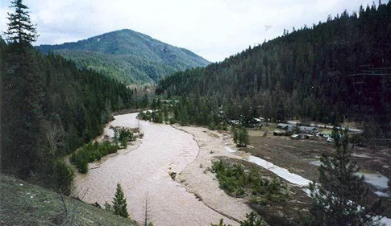

# {{ site.title }}

The Idaho Waters Digital Library provides open digital access to unique information resources relating to water issues in key Idaho river basins.

The collection includes scientific and technical reports, with an emphasis on [Idaho Water Resources Research Institute](http://www.uidaho.edu/research/entities/iwrri) publications.
[Documents]({{ "/docs/" | relative_url }}) can be browsed by [Location]({{ "/map/" | relative_url }}), [Date]({{ "/timeline/" | relative_url }}), and [Subject Term]({{ "/subjects/" | relative_url }}).
The database can also be queried extensively using the [Table]({{ "/docs/" | relative_url }}) feature.

The full descriptive metadata can be downloaded as a [CSV spreadsheet]({{ "/export/iwdl-data.csv" | absolute_url }}) or a [GeoJSON export]({{ "/export/iwdl-geodata.json" | absolute_url }}).

This project would not have been possible without the grant support of the United States Geological Survey and the Idaho Water Resources Research Institute, the metadata and digitization work of Warren Bromley-Vogel and Karen Trebitz, and the ground work and continuing efforts of Jodi Haire.
